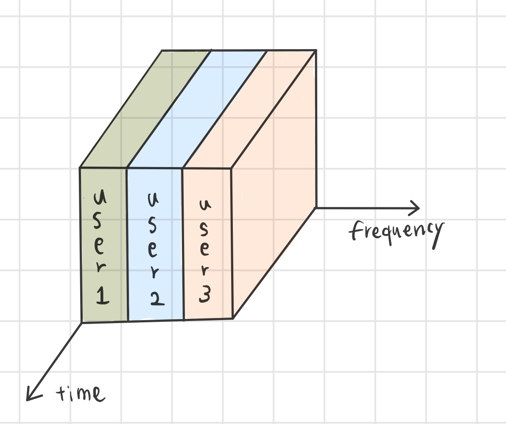
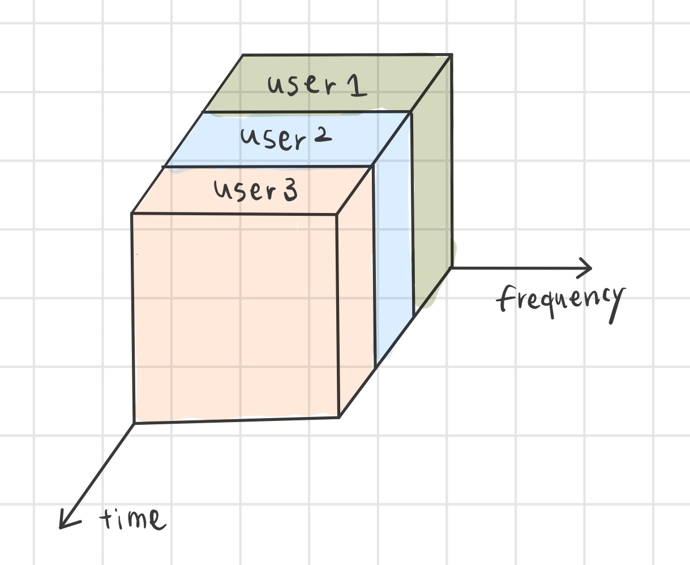
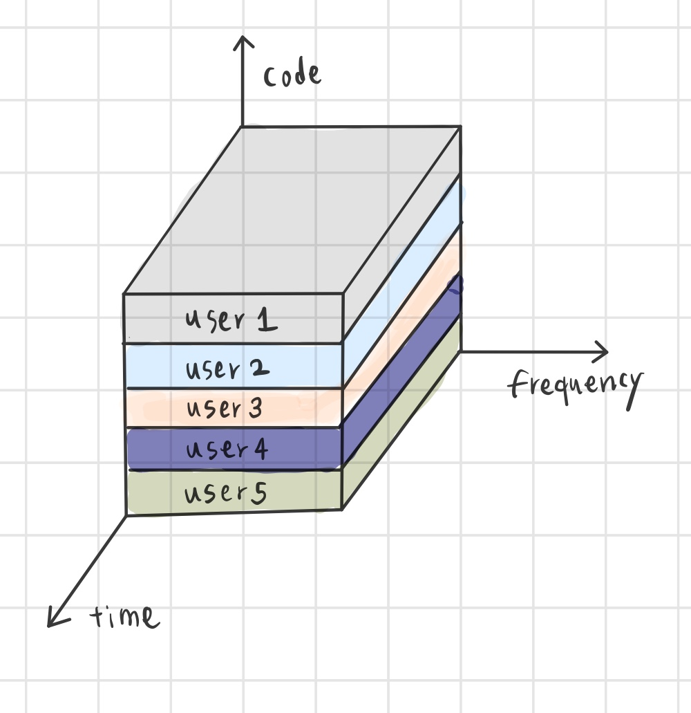

모바일 네트워크는 휴대폰이나 이동 통신 등에 이용되는 광역 무선 네트워크를 의미합니다. 

# 무선과 전용 회선을 사용하는 모바일 네트워크

스마트폰 등에서 이용하는 모바일 네트워크는 휴대 단말기, 기지국, 교환국 세 가지 노드로 구성됩니다. 

휴대 단말기와 기지국은 무선으로 연결되어 음성이나 데이터를 주고받습니다. 기지국과 교환국 사이는 일반적으로 전용 회선으로 연결됩니다. 교환국은 전화번호로 상대방의 교환국을 찾고, 그 상대방과 연결 가능한 기지국에 연결합니다.

휴대 단말기가 어떤 기지국과 통신할 수 있는지 조사해야 하고, 교환국은 이 정보를 이용하여 연결을 설정합니다. 단말기는 이동하기 때문에 통신 가능한 기지국을 적절히 전환할 필요가 있습니다. 이 기술을 핸드오버라고 합니다.

# 발전되어 가는 모바일 네트워크

## 1G, FDMA

1세대 이동통신에는 FDMA(주파수 분할 다중 접속) 방식이 사용되었습니다.

FDMA 접속을 원하는 사용자에게 각각 다른 주파수를 할당해주는 방식입니다. 다중 접속 방식 중 가장 심플하며, 오래된 방식입니다

이러한 FDMA 기술은 주파수 이용 효율에 한계가 있다는 단점이 있습니다. 

즉 다수의 사용자가 한번에 접속하기에는 주파수가 부족하다는 뜻입니다. 따라서, 사용자가 많아 주파수 이용 효율이 중요한 이동 통신은 TDMA나 CDMA 방식이 등장하였고, 최근에는 OFDMA 방식을 주로 사용하고 있습니다.

또한 1G는 아날로그 기반으로, 음성을 전기 신호로 전달했기에 오로지 음성 통화만 가능했습니다.

## 2G,

세계적인 이동전화 수요의 급증으로, 1G 기술인 FDMA의 주파수 한계 문제를 피할 수 없게 되었습니다.

1990년대 중반부터는 아날로그 시대 다음인 디지털 시대로 전환되기 시작합니다.

디지털 데이터는 0과 1의 값만 가지기 때문에 비교적 데이터 처리 용량이 크지 않으며, 다른 주파수 신호의 간섭으로 신호가 왜곡되더라도 쉽게 간섭 신호를 제거해 원래의 디지털 신호로 복원이 가능합니다.

또한 음성 통화만 가능했던 1G와 달리 문자같은 텍스트 데이터 전송이 가능해졌습니다. 이 모든 건 아날로그 신호를 디지털 신호로 전환하는 기술이 도입되었기 때문에 가능한 것입니다.

2G 이동통신에서 주로 사용되는 기술 표준은 두가지로 나뉩니다.

### GSM

GSM(Global System for Mobile Communication)은 유럽 중심으로 개발이 진행되었으며, TDMA(시분할 다중접속) 기술이 적용되었습니다.

TDMA는 시간 축을 여러 시간 구간으로 나누어 특정 시간을 정하고 해당 시간 동안은 사용자가 전체 주파수 대역을 사용하는 방식입니다.

가용 주파수 전대역이 할당되기에 FDMA보다 인접 주파수 대역 간 간섭으로부터 자유로운 편입니다. 또한 FDMA에 비해 주파수 효율이 높습니다.

다만, 수신 시에 반송파 동기, 비트 시간 복원, 프레임 동기 등이 필요해 복조가 복잡하여 데이터 프레임화에 따른 오버헤드 부담이 있다는 단점이 존재합니다.

### IS-95

미국 주심으로 개발된 IS-95는 퀄컴에서 개발한 CDMA(Code Division Multiple Access) 기반의 디지털 셀룰러 표준입니다.

CDMA는 스펙트럼 확산 기법을 응용해 동일 주파수, 동일 시간대의 복수 개 신호 중에서 순간적으로 단일 특정 신호를 인지하는 기법입니다. CDMA에서는 특정 코드를 이용하여 하나의 셀에 다중의 사용자가 접속할 수 있도록 합니다. 

구체적으로는 가입자마다 서로 다른 고유 확산 부호를 할당받아 신호를 스펙트럼 확산을 적용하여 전송하면, 사용자 확산부호를 알고 있는 수신기에서만 이를 복원해 해당 주파수 대역을 사용하게끔 합니다.

## 그 이후...

- 3G -&gt; CDMA, W-CDMA
- 4G -&gt; OFDMA, SC-FDMA
- 5G -&gt; CP-OFDM, CP-OFDM/DFT-s-OFDM

